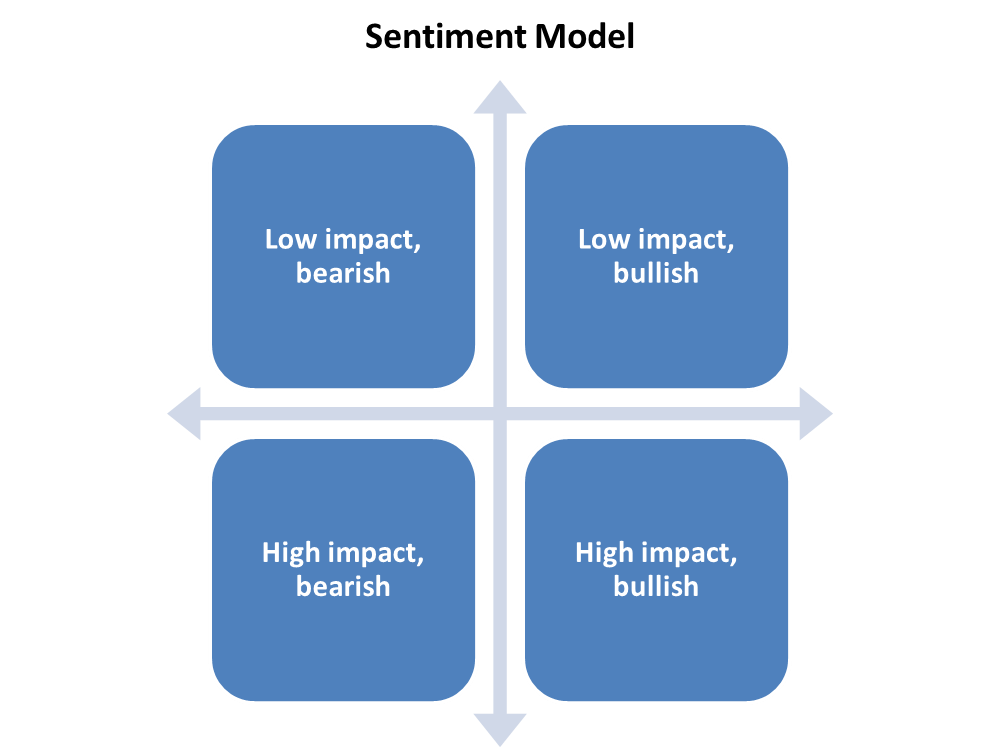
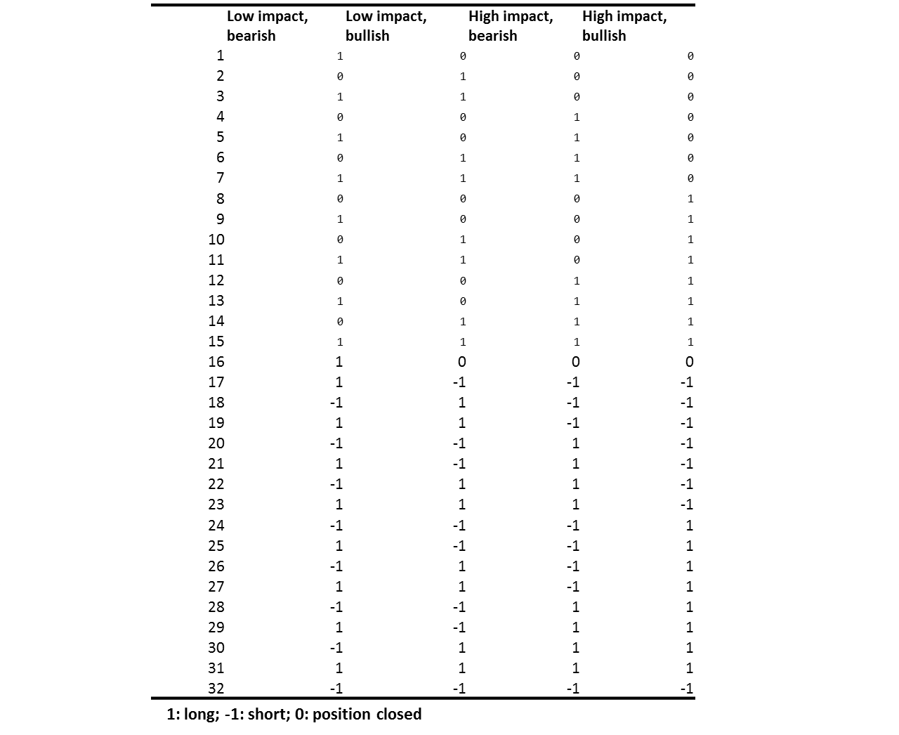
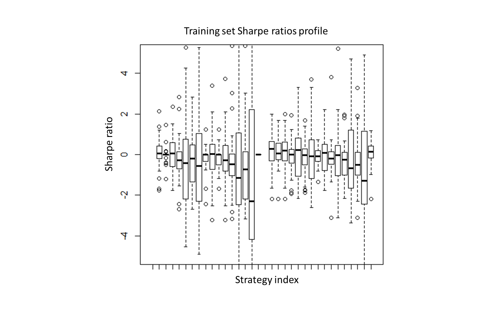

## Executive Summary

===========================================

In this report, we build a simple 4-states model based on the sentiment scores collected from FinSentS portal. By mining 32 trading strategies, we get a strategy with average Sharpe ratio 0.1975, bench-marked by buy-hold strategy in a 20 stocks' test set. 

## Introduction

===========================================

The sentiment information from News, Blog and Social Media is helpful for investors making investment decisions. However, it is simply too much information on the web to digest manually. FinSenS innovatively transforms the text, voice and videos into sentiment scores, which can be directly integrated into trading strategies/algorithms, risk and compliance system. 

## Implementation

===========================================

### Data Collection and 4 states Model

A random sample of 51 USA stocks data are collected from FinSentS portal. Each data contains daily stock price, sentiment scores and sentiment volume and so on. 

The sentiment scores is in range of 0 to 10. Simply, we define a bullish sentiment when the sentiment score is above 5, otherwise, a bearish sentiment. Sentiment volume provides information on the strength of sentiment score. High sentiment volume suggests a high impact of the current sentiment. To simplify the problem, we define high impact when sentiment volume is higher than 5, otherwise low except 0, which indicate no updated sentiment

According to the above analysis, we are able to classify the market sentiment into four states: bear+high, bull+high, bull+low, bear+low. Since the sentiment scores are often discontinuous meaning that no valid sentiment score in some days. The imputing Technics here is rolling over the recent valid sentiment score until new valid one forms. Also the weekend and holiday data are removed and only the close price are used in calculation of return and Sharpe ratio.

### Trading Strategy Selection

A sentiment based trading strategy is to systematically make trading decisions according to the market sentiment status. Instead of making any judgments, we choose to let the market tells stories. Here we list all 32 potential actions regarding this simple four states model including both buy-only and buy-short strategies.

To select the best trading strategy in our strategy pool, we divide our data-set into training (30 stocks) and test set (21 stocks) and use Sharpe ratio as our metric (buy-hold as benchmark). Then we select the strategy with the largest median Sharpe ratio in the training set and estimate its performance in the test set.

As a result, the best strategies are 

## Limitations

=============================================

1. The total number of data is small and probably biased since all the data are collected in USA market from 25-10-2014 to 2-5-2015.
2. The calculation doesn't consider the trading cost in both buy-only and buy-short strategy.
3. The overall results are not statistically significant as shown in the following figure. 

